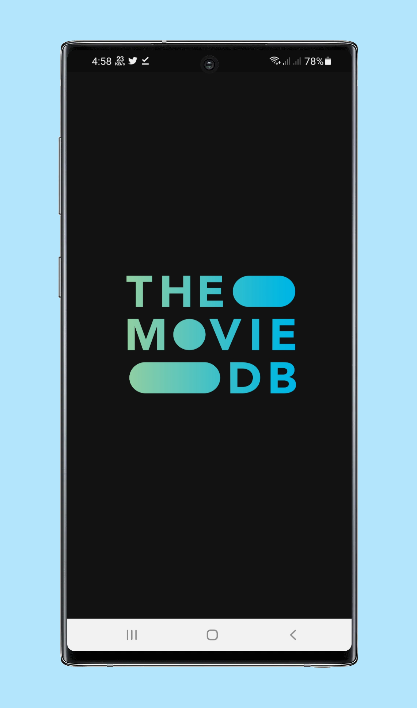
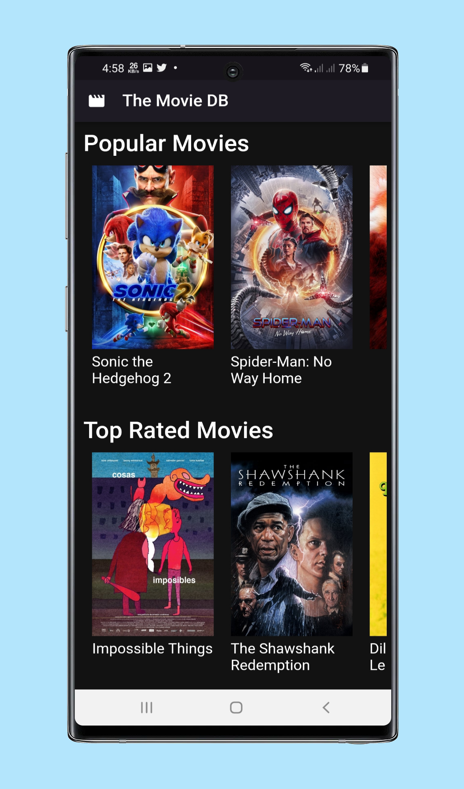
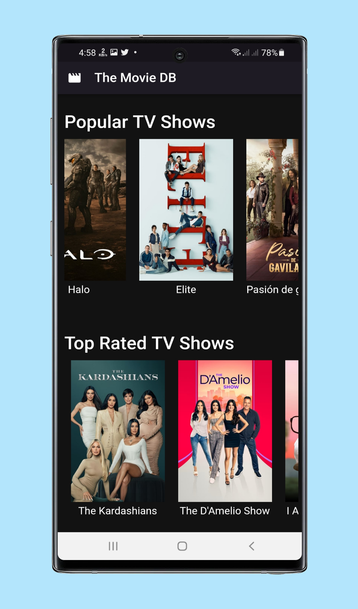
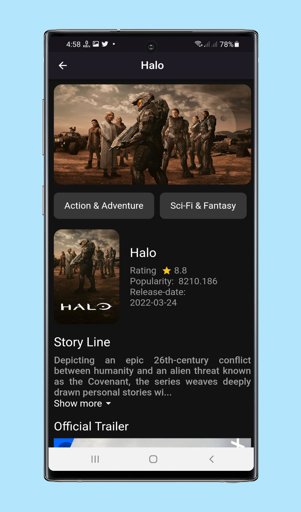
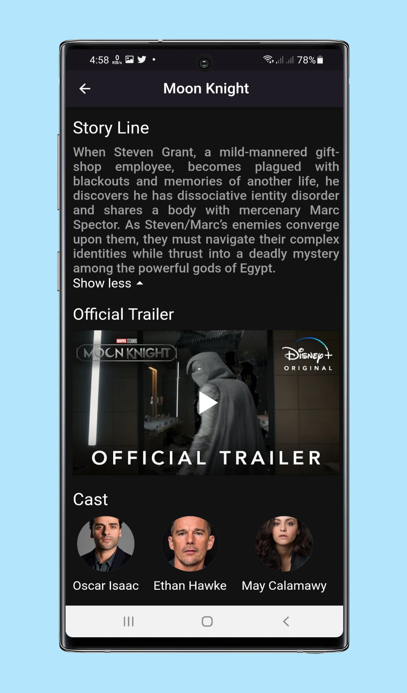

# Introduction

> “TMDB movie app”

## :bulb: Key Features (or What will you learn, if you are here to learn)

- [x] List Of Popular Movies
- [x] List Of Trending Movies
- [x] List Of Top Rated Movies
- [x] List Of Popular TV Shows
- [x] List Of Top rated Tv Shows
- [x] Check Movie Details
- [x] API Integration
- [x] Open Movie Trailer on YouTube
- [x] GetX State Management

## 🚀 &nbsp;Installation

To clone and run this application, you'll need [Git](https://git-scm.com) and [Flutter](https://flutter.dev/docs/get-started/install) installed on your computer. From your command line:

```bash
# Clone this repository
$ git clone https://github.com/mostafijur566/flutter_movie_api.git

# Go into the repository
$ cd TMDB-movie-app

# Install dependencies
$ flutter pub get

# Run the app
$ flutter run

# You can also run this app on Web (Not Optimized and Flutter Beta or Above Channel Required)
$ flutter run -d chrome
```

### Packages

Below are the information about packages used in this project.

| Package                                                                          |
| -------------------------------------------------------------------------------- | 
| [get](https://pub.dev/packages/get)                                              |
| [youtube_player_flutter](https://pub.dev/packages/youtube_player_flutter)        |

### API Used

`https://www.themoviedb.org/documentation/api`

### Directory Structure

The project directory structure is as follows:

```
├── android
├── asset
├── build
├── ios
├── lib
    ├── controller
    ├── data
    ├── helper
    ├── models
    ├── pages
    ├── routes
    ├── utils
    ├── widgets
    ├── main.dart
├── pubspec.lock
├── pubspec.yaml

```

## :heart: Contributor

Made by [Mostafijur Rahman](https://github.com/mostafijur566)

## :camera_flash:

   
   
   